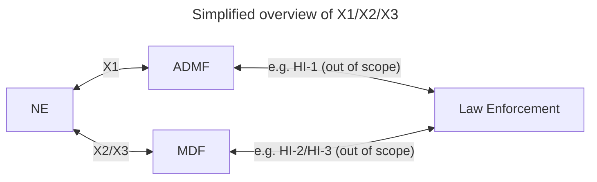

# Java Library for ETSI TS 103 221 Lawful Interception

This is an open source implementation of the ETSI X1 / X2 and X3 interfaces for lawful interception of
telecommunications. At sipgate, we have to provide these interfaces to the authorities, and we decided to open source
our implementation so others can learn and inspect how this actually works in code.

## Installation

Maven:

```xml
<depedency>
    <groupId>com.sipgate</groupId>
    <artifactId>li-lib-x1x2x3</artifactId>
    <version>1.0.0</version>
</dependency>
```

Gradle (Kotlin DSL):

```kotlin
implementation("com.sipgate:li-lib-x1x2x3:1.0.0")
```

Gradle (Groovy DSL):

```groovy
implementation 'com.sipgate:li-lib-x1x2x3:1.0.0'
```

## Overview of X1/X2/X3



In this simplified version the NE is also the Point of Interception (POI) for example an asterisk PBX.

- **ADMF** = **ADM**inistration **F**unction
- **HI** = **H**andover **I**nterface 1
- **MDF** = **M**ediation and **D**elivery **F**unction
- **NE** = **N**etwork **E**lement

## Provided building blocks

You can use this library to implement:

- ADMF (HI out of scope)
- NE completeley
- MDF (HI out of scope)

This library offers client and server implementations for the X1/X2/X3 protocols:

- [X1Client](src/main/java/com/sipgate/li/lib/x1/client/X1Client.java)
- [X1Server](src/main/java/com/sipgate/li/lib/x1/server/X1Server.java)
  - This class supports the server-side of the Network Element. You have to implement the server-side of other roles yourself.
- [X2X3Client](src/main/java/com/sipgate/li/lib/x2x3/client/X2X3Client.java)
- [X2X3Server](src/main/java/com/sipgate/li/lib/x2x3/server/X2X3Server.java)

This library does not implement your persistence layer. Use the repository interfaces to implement those.

- [DestinationRepository](src/main/java/com/sipgate/li/lib/x1/server/repository/DestinationRepository.java)
- [TaskRepository](src/main/java/com/sipgate/li/lib/x1/server/repository/TaskRepository.java)

This library does not implement the business logic on your side (e.g. activation of interception in your SIP stack). Use the listener interfaces to implement those.

- [DestinationListener](src/main/java/com/sipgate/li/lib/x1/server/listener/DestinationListener.java)
- [TaskListener](src/main/java/com/sipgate/li/lib/x1/server/listener/TaskListener.java)

When you want to intercept and forward SIP or RTP, then use the `X2X3Client` in your business logic.

When you want to receive the intercepted SIP or RTP over X2/X3, then use the `X2X3Server` and add `Consumer` implementations.

## Examples

Below you find code snippets for several use cases. If you want to see a complete ADMF implmentation with a REST interface, see our [LI simulator](https://github.com/sipgate/li-simulator-x1x2x3).

### Start X1 server

```java
// set to null if you want to disable mutual TLS (not recommended)
final var sslContext = SSLContextBuilder.newBuilder()
        .withKeyStore(Path.of("keystore.jks"), "password")
        .withTrustStore(Path.of("truststore.jks"), "password")
        .build();

// use your implementation instead (e.g. store to pgsql)
final var destinationRepository = new YourDestinationRepositoryImpl();
final var taskRepository = new YourTaskRepositoryImpl();

// use your implementation instead (e.g. control your SIP/RTP stack)
final var taskListener = new NoopTaskListener();
final var destinationListener = new NoopDestinationListener();

// use your implementation instead (e.g. wrap Micrometer)
final var metricsService = new NoopMetricsService();

final var x1Server = X1Server.createNetworkElement(
                sslContext,
                destinationRepository,
                taskRepository,
                "network-element-id"
        )
        .setTaskListener(taskListener)
        .setDestinationListener(destinationListener)
        .setMetricsService(metricsService);

// listen on TCP port 8443 for any IPv4 address
// this call blocks, so start it in a separate thread if needed
x1Server.start(new InetSocketAddress("0.0.0.0", 8443));
```

### Forward SIP/RTP via X2/X3

```java
// set to null if you want to disable mutual TLS (not recommended)
final var sslContext = SSLContextBuilder.newBuilder()
        .withKeyStore(Path.of("keystore.jks"), "password")
        .withTrustStore(Path.of("truststore.jks"), "password")
        .build();

final var socketFactory = sslContext.getSocketFactory();

final List<TLV> conditionalAttributes = new ArrayList<>(List.of(
        /* add your TLVs according to your business logic */
        new TimestampTLV(Instant.now())
));

// forward RTP, change this according to your business logic
final var pduObject = new PduObjectBuilder()
        .rtp()
        .payloadDirection(PayloadDirection.SENT_TO_TARGET)
        .correlationID(new byte[]{/* fill according to X2/X3 standard */})
        .xid(UUID.randomUUID() /* use the XID from the task activation via X1 */)
        .conditionalAttributeFields(conditionalAttributes)
        .payload(new byte[]{/* raw RTP payload */})
        .build();

final var timeout = 30_000; // milliseconds
final var client = new X2X3Client(socketFactory, "1.2.3.4", 12345, timeout);
client.send(pduObject);
```

### Send X1 request

```java
// set to null if you want to disable mutual TLS (not recommended)
final var sslContext = SSLContextBuilder.newBuilder()
        .withKeyStore(Path.of("keystore.jks"), "password")
        .withTrustStore(Path.of("truststore.jks"), "password")
        .build();

final var requestFactory = new X1RequestFactory(DatatypeFactory.newInstance(), "ne-id", "admf-id");
final var request = requestFactory.builder(ListAllDetailsRequest.builder()).build();

final var client = X1ClientBuilder.newBuilder().withTarget("https://ne.example.org:8443/X1/NE").withContext(sslContext).build();
// when you send other types of request, change the response class
// when a request fails, an X1ClientException is thrown
final var response = client.request(request, ListAllDetailsResponse.class);

System.out.println(resp.getListOfXIDs());
```

### Start X2/X3 server to receive SIP/RTP via X2/X3

```java
// set to null if you want to disable mutual TLS (not recommended)
final var sslContext = SSLContextBuilder.newBuilder()
        .withKeyStore(Path.of("keystore.jks"), "password")
        .withTrustStore(Path.of("truststore.jks"), "password")
        .build();

final var maxHeaderLength = 320;
final var maxPayloadLength = 8192;

// implement your business logic for receiving SIP/RTP via X2/X3 here
final Consumer<PduObject> pduConsumer = (pduObject) -> {};

final var server = new X2X3Server(
      sslContext,
      new X2X3Decoder(maxHeaderLength, maxPayloadLength)
    ).addConsumer(pduConsumer);

// listen on TCP port 12345 for any IPv4 address
// this call blocks, so start it in a separate thread if needed
server.start(new InetSocketAddress("0.0.0.0", 12345));
```

## Metrics

In order to collect Metrics, implement the interface `MetricsService` and set it on the `X1Server`.

| Metric name                  | Type    | Tags              | Description                                                                                  |
| ---------------------------- | ------- | ----------------- | -------------------------------------------------------------------------------------------- |
| `li_x1_errorResponse`        | Counter | `request`, `code` | Number of returned X1 error responses                                                        |
| `li_x1_exception`            | Counter | `type`            | Number of requests that failed because of a Java exception (`type` is the simple class name) |
| `li_x1_handleRequestMessage` | Timer   | `type`            | Execution time of `handleRequestMessage`, type = SimpleClassName                             |
| `li_x1_requestContainer`     | Counter | `size`            | Number of X1 request container and their size                                                |
| `li_x1_requestError`         | Counter | `type`            | Number of requests that caused a TopLevelError (currently: `type`=`unknown_message_type`)    |
| `li_x1_requestMessage`       | Counter | `type`, `version` | Number of received X1 request messages, SimpleClassName and version in RequestMessage xml    |
| `li_x1_responseMessage`      | Counter | `type`            | Number of returned X1 response messages, type = SimpleClassName                              |

## Local development

1. `git clone` the repository
2. Run `npm install` for git hooks and prettier (code formatting)

## Preparing a new release

We're using the [Maven release plugin](https://maven.apache.org/maven-release/maven-release-plugin/index.html).
When ready, run `mvn release:prepare` and follow the instructions. This will create, tag and push a new release.

## Generate Java Classes based on XSD

1. Get the main XSDs from
   - [https://www.etsi.org](https://www.etsi.org/standards-search#page=1&search=103%20221-1&title=1&etsiNumber=1&content=0&version=0&onApproval=1&published=1&withdrawn=1&historical=0&isCurrent=1&superseded=1&startDate=1988-01-15&endDate=2040-01-01&harmonized=0&keyword=&TB=&stdType=&frequency=&mandate=&collection=&sort=1)
2. Get XSD dependencies
   - https://www.etsi.org/deliver/etsi_ts/103200_103299/103280/02.12.01_60/
3. Extract all XSD files into [generate/src/main/resources](generate/src/main/resources)
4. Check the catalog file [generate/src/main/resources/ts_103.cat](generate/src/main/resources/ts_103.cat) for the correct schema location patches
   - look for the `<xs:import>` tags and check the filenames against the catalog
5. Now, you can run `make` in `generate` or:
   1. Generate the Java source files from the XSDs with `mvn clean verify`
   2. Copy the generated Java files from `generate/target/generated-sources/xjc` to the `src/main/java` folder
      - look for the `org.etsi` package for the main classes
      - as well as the `com.kscs.util` package for the utilities from the rich-contract plugin

```bash
cd generate
make
```

## Further information

- TS 103 200 with multiple versions (PDF, XSDs, some versions have examples): https://www.etsi.org/deliver/etsi_ts/103200_103299/10322101/
